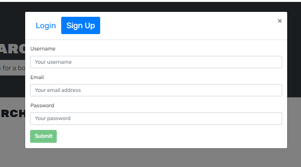

# 21 MERN: Book Search Engine

## Description 
We were tasked to examine started code which was a fully functioninh Google Books API search engine built with RESTful API, and refactor it to be used with GraphQL API built with Apollo Server. The app was built using the MERN stack with a react front end, MonhoDB database and Node.js/Express.js server and API. 

One of the biggest challenges with this task was going through all the code to understand how it was already functioning. However, this was an important task as i know feel confident in refactoring RESTful API to a GraphQL API built with Apollo Server. 

In order to complete the tasked, the following needed to be complete: 

1. Set up an Apollo Server to use GraphQL queries and mutations to fetch and modify data, replacing the existing RESTful API.

2. Modify the existing authentication middleware so that it works in the context of a GraphQL API.

3. Create an Apollo Provider so that requests can communicate with an Apollo Server.

4. Deploy your application to Heroku with a MongoDB database using MongoDB Atlas. 

The following changes were made to the code: 

### Back-End Specifications

You’ll need to complete the following tasks in each of these back-end files:

* `auth.js`: Update the auth middleware function to work with the GraphQL API.

* `server.js`: Implement the Apollo Server and apply it to the Express server as middleware.

	> **Important**: Apollo Server recently migrated to Apollo Server 3. This major-version release impacts how Apollo Server interacts in an Express environment. To implement Apollo Server 2 as demonstrated in the activities, you **MUST** use the following script `npm install apollo-server-express@2.15.0` to install Apollo Server 2. Alternately, to migrate to the latest version of Apollo Server, please refer to the [Apollo Server Docs on Migrating to Apollo Server 3](https://www.apollographql.com/docs/apollo-server/migration/#nodejs) and [Apollo Server Docs on Implementing Apollo Server Express with v3](https://www.apollographql.com/docs/apollo-server/integrations/middleware/#apollo-server-express). Note that if you are using Apollo Server 3 you are required use `await server.start()` before calling `server.applyMiddleware`.

* `Schemas` directory:

	* `index.js`: Export your typeDefs and resolvers.

	* `resolvers.js`: Define the query and mutation functionality to work with the Mongoose models.

		**Hint**: Use the functionality in the `user-controller.js` as a guide.

	* `typeDefs.js`: Define the necessary `Query` and `Mutation` types:

		* `Query` type:

			* `me`: Which returns a `User` type.
		
		* `Mutation` type:

			* `login`: Accepts an email and password as parameters; returns an `Auth` type.

			* `addUser`: Accepts a username, email, and password as parameters; returns an `Auth` type.

			* `saveBook`: Accepts a book author's array, description, title, bookId, image, and link as parameters; returns a `User` type. (Look into creating what's known as an `input` type to handle all of these parameters!)

			* `removeBook`: Accepts a book's `bookId` as a parameter; returns a `User` type.
			
		* `User` type:

			* `_id`

			* `username`

			* `email`

			* `bookCount`

			* `savedBooks` (This will be an array of the `Book` type.)

		* `Book` type:

			* `bookId` (Not the `_id`, but the book's `id` value returned from Google's Book API.)

			* `authors` (An array of strings, as there may be more than one author.)

			* `description`

			* `title`

			* `image`

			* `link`

		* `Auth` type:

			* `token`

			* `user` (References the `User` type.)

### Front-End Specifications

You'll need to create the following front-end files:

* `queries.js`: This will hold the query `GET_ME`, which will execute the `me` query set up using Apollo Server.

* `mutations.js`:

	* `LOGIN_USER` will execute the `loginUser` mutation set up using Apollo Server.

	* `ADD_USER` will execute the `addUser` mutation.

	* `SAVE_BOOK` will execute the `saveBook` mutation.

	* `REMOVE_BOOK` will execute the `removeBook` mutation.

Additionally, you’ll need to complete the following tasks in each of these front-end files:

* `App.js`: Create an Apollo Provider to make every request work with the Apollo Server.
	
* `SearchBooks.js`:

	* Use the Apollo `useMutation()` Hook to execute the `SAVE_BOOK` mutation in the `handleSaveBook()` function instead of the `saveBook()` function imported from the `API` file.

	* Make sure you keep the logic for saving the book's ID to state in the `try...catch` block! 

* `SavedBooks.js`:

	* Remove the `useEffect()` Hook that sets the state for `UserData`.

	* Instead, use the `useQuery()` Hook to execute the `GET_ME` query on load and save it to a variable named `userData`.

	* Use the `useMutation()` Hook to execute the `REMOVE_BOOK` mutation in the `handleDeleteBook()` function instead of the `deleteBook()` function that's imported from `API` file. (Make sure you keep the `removeBookId()` function in place!)

* `SignupForm.js`: Replace the `addUser()` functionality imported from the `API` file with the `ADD_USER` mutation functionality.

* `LoginForm.js`: Replace the `loginUser()` functionality imported from the `API` file with the `LOGIN_USER` mutation functionality.

[To view the deployed application please click here](https://whispering-lowlands-75056.herokuapp.com/)

## Table of Contents 
- [Installation](#installation)
- [Usage](#usage)
- [Features](#features)
- [Credits](#credits)
- [License](#license)

## Installation
In order to get this application installed on your device there are a few steps that need to occur. 
Firstly, you must clone the code to your machine. 
Once the the code has been cloned, in the root folder open the command line and enter 'npm install'. This will install all neccessary dependecnies that are required for the application to launch. 

Once this has complete, enter 'npm run build' this will allow the application to build and finally enter 'npm run develop' this will allow both the front end and back end server to run concurrently. 

## Usage
The application is straightforward to use. 

A user can search for any book to see if it is in the database. 

However to save Books the user must signup. This is done by completing the form that requires a username, email and password. 

If the user decides to save a book to their collection they click on the button savebook, and it will change to "book saved" 

They can then click on 'see you books' to view all the books saved in their collection. 

If the user decides to remove a book from their collection they simply click 'Delete this book' and the book is removed. 

## Features 
- apollo-server-express 
- concurrently 
- bcrypt
- express
- jsonwebtoken
- mongoose 
- graphql
- nodemon 
- apollo 
- bootstrap
- jwt-decode
- react-dom 
- react-router-dom
- react-scripts 
- react-bootstrap 

## Contribute
If you would like to contribute to this project please contact me via email at micahelwest.webdev@gmail.com

## License
This project is released under the [MIT LICENSE](https://github.com/mjhwest/Book-Search-Engine-/new/main)